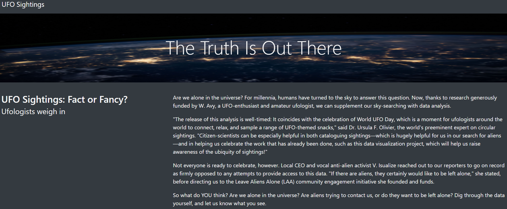
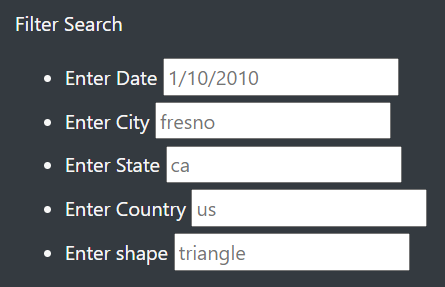
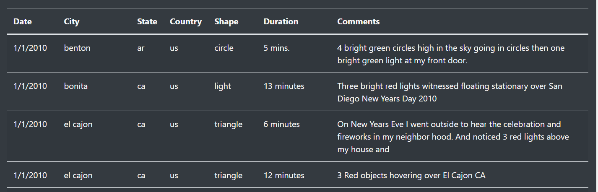

# UFOs

## Project Overview
Dana is writing an article about UFO sightings in her hometown of McMinville, Washington, which is famous for this phenomenon. Included with her article she will be using JavaScript to create a table that has several filters to manipulate the data, making it user-friendly to sift through.

Dana's final product will be an HTML page that includes her article, the table of data to support her findings, and easy to use filters.

## Results
Dana's final product is a sleek, interactive, and easy to use webpage about UFO sightings.

### Read the article.
The first thing users will see when going to Dana's website is her article.

### Enter filters to search by.
After users' interest is peaked by the world of UFOs, they can choose up to five filters to use to narrow down the data.
- Date
- City
- State
- Country
- Shape

### Review the table.
After entering the search criteria, users will be presented with a table of UFO data based on their preferred filters.

### Complete a new search.
Users can complete multiple searches by entering new search criteria.

### Clear the filters.
To clear the filters and view the original table, users will click on the navigation bar at the top of the webpage.

## Summary

### Drawback
Dana's webpage provides users with plenty of UFO data to sift through, however, with its current setup, the data is limited - new sightings will not be updated in her table.

### Recommendations
To further advance her website, Dana can utilize web scraping to ensure she consistently collecting new information about sightings. Another recommendation is to update her search filters to allow for date ranges to be included, rather than simply one specific date. Given the unpredictable nature of UFO sightings, loosening the restrictions for this filter will allow users more flexibility with their queries.
